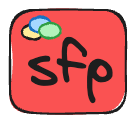
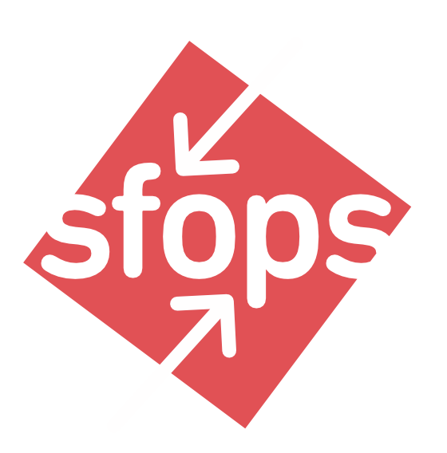

# Toolbox

## Build Automation

<table><thead><tr><th width="182">Name</th><th width="127">Status</th><th>Description</th></tr></thead><tbody><tr><td> <a href="https://app.gitbook.com/o/fKx1Ub4x8BCvXSpvO1Hz/s/YLI5Ts7pWhWQV9UaBn3H/"><strong>sfp</strong></a></td><td>Open Source, Maintained by flxbl</td><td>sfp is the core automation engine that powers a flxbl project. <strong>sfp</strong> aims to streamline and automate the build, test, and deployment processes of Salesforce metadata,  code, and data. It extends <strong>sf cli</strong> functionalities, focusing on artifact-driven development to support #flxbl salesforce project development. Head to sfp docs by clicking <a href="https://docs.flxbl.io/sfp">here</a></td></tr><tr><td><a href="https://app.gitbook.com/o/fKx1Ub4x8BCvXSpvO1Hz/s/YLI5Ts7pWhWQV9UaBn3H/">sfp-pro</a></td><td>Source Available with Perpetual Fallback Rights</td><td>sfp-pro is a superset of sfp, with advanced capabilities. Refer to <a href="https://features.flxbl.io">features.flxbl.io</a> for a comparison</td></tr></tbody></table>

## CI/CD

<table><thead><tr><th width="182">Name</th><th width="127">Status</th><th>Description</th></tr></thead><tbody><tr><td> <a href="https://app.gitbook.com/o/fKx1Ub4x8BCvXSpvO1Hz/s/lMXJauKOgXVlDwo5NJ6c/"><strong>sfops</strong></a></td><td>Source Available with Perpetual Fallback Rights</td><td>sfops is a purpose built orchestration layer built on <a href="https://www.github.com">Github</a> utilizing Github's functionalities such as workflows, actions, package registry, pull requests  and much more to provide a project team to adopt and maintain a flxbl project within the shortest time span.  Head to sfops docs by clicking <a href="https://docs.flxbl.io/sfops">here</a></td></tr></tbody></table>

## Tools

<table><thead><tr><th width="184">Name</th><th width="133">Status</th><th>Description</th></tr></thead><tbody><tr><td><a href="https://get-codev.flxbl.io">codev</a></td><td>Source Available with Perpetual Fallback Rights</td><td>Codev is a multiplayer capable  Desktop based companion application for visual collaboration and operatins within a Flxbl project</td></tr><tr><td>  <strong>sfmdu</strong></td><td>Open Source, Maintained by Salesforce</td><td>sfdmu is a top notch data migration tool that helps to migrate records from an org or csv files to another org. sfdmu supports all CRUD Operations while maintaining referential integrity across multiple sObjects.  Checkout the documentation <a href="https://help.sfdmu.com/">here</a></td></tr><tr><td>  <strong>browserforce</strong></td><td>Open Source</td><td>browserforce allows one to shape a sandbox or scratch org where there are gaps in the Salesforce API using UI based automation. The docs for browserforce are available <a href="https://github.com/amtrack/sfdx-browserforce-plugin">here</a></td></tr><tr><td> <strong>pmd</strong></td><td>Open Source</td><td><strong>PMD</strong> is a source code analyzer. It finds common programming flaws like unused variables, empty catch blocks, unnecessary object creation, and so forth. PMD's docs are available <a href="https://pmd.github.io/">here</a></td></tr></tbody></table>

## Libraries

<table><thead><tr><th width="182">Name</th><th width="157">Status</th><th>Description</th></tr></thead><tbody><tr><td><a href="https://github.com/flxbl-io/sfdc-feature-management"><strong>sfdc-feature-management</strong></a></td><td>Open Source, Maintained by flxbl</td><td>This library provides a consistent way to check if a given feature is enabled in Salesforce.</td></tr><tr><td><a href="https://github.com/flxbl-io/sfdc-trigger-framework"><strong>sfdc-trigger-framework</strong></a></td><td>Open Source, Maintained by flxbl</td><td>Lightweight metadata driven trigger framework for Salesforce.</td></tr><tr><td><a href="https://github.com/jongpie/NebulaLogger"><strong>nebula logger</strong></a></td><td>Open Source</td><td>Nebula Logger is a robust logger for Salesforce. Works with Apex, Lightning Components, Flow, Process Builder &#x26; Integrations. Designed for Salesforce admins, developers &#x26; architects.</td></tr><tr><td>flxbl-execution-framework</td><td>Source Available with Perpetual Fallback Rights</td><td>A powerful, flexible framework for managing and orchestrating business logic execution in Salesforce. This framework provides a unified approach to handling synchronous and asynchronous operations, with built-in support for error handling, retry logic, and execution tracking.</td></tr></tbody></table>

